# Manual – Instalación Oracle 19c en Oracle Linux 7


---

Instalación de Oracle 19c en Oracle Linux 7.9 (OL7U9).

| Parámetro                   | Valor                  |
| :-------------------------- | :--------------------- |
| Hostname                    | `oracle.homelab.local` |
| IP                          | `192.168.2.10`         |
| Usuario SO                  | `ora19c`               |
| Clave SO                    | `ora19c`               |
| Base de datos               | `PRUEBAS`              |
| Usuario Oracle (aplicación) | `SYSBACKUP`            |
| Clave Oracle                | `T3CN0L0G14`           |
| Modo                        | ARCHIVELOG             |

---

## 🔹 Paso 1: Preparación del sistema operativo

### 1.1 Instalar Oracle Linux 7.9

- Usar el ISO: `OracleLinux-R7-U9-Server-x86_64-dvd.iso`
- Seleccionar Server with GUI
- Particionado recomendado:
  - `/u01` → mínimo 50 GB
  - Swap = 1.5x RAM (si tienes 8 GB RAM → 12 GB swap)

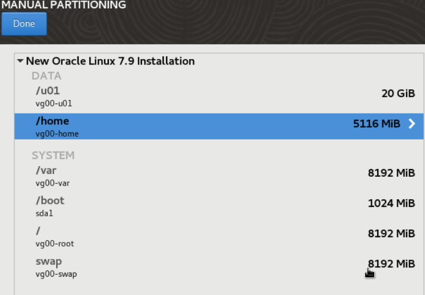

### 1.2 Configuración de red

Identificar la interfaz de red activa:

```bash
ip -o link show | awk -F': ' '{print $2}' | grep -v lo
```

Ejemplo de salida: `eth0`

Configurar IP estática, gateway, DNS y desactivar IPv6:

```bash
sudo nmcli con mod eth0 ipv4.addresses 192.168.2.10/24 \
  ipv4.gateway 192.168.2.1 \
  ipv4.dns "8.8.8.8 8.8.4.4" \
  ipv4.method manual \
  ipv6.method ignore
```

Activar la conexión:

```bash
sudo nmcli con up eth0
```

Verificar configuración:

```bash
ip a show eth0
nmcli dev show eth0 | grep IP
```

Agregar entrada en `/etc/hosts`:

```bash
echo "192.168.2.10 oracle.homelab.local oracle" | sudo tee -a /etc/hosts
```

### 1.3 Seguridad

```bash
# Desactivar SELinux (para laboratorio)
sudo sed -i 's/^SELINUX=.*/SELINUX=disabled/' /etc/selinux/config

# Abrir puertos Oracle
sudo firewall-cmd --permanent --add-port=1521/tcp
sudo firewall-cmd --reload
```

Opcional en Lab — impedir que firewalld arranque en cada boot:

```bash
systemctl stop firewalld && systemctl disable firewalld
```

### 1.4 Paquetes requeridos

En OL7.9 funciona el preinstall:

```bash
sudo yum install -y oracle-database-preinstall-19c
```

Si no, instalar manualmente:

```bash
sudo yum install -y bc binutils compat-libcap1 compat-libstdc++-33 \
  elfutils-libelf elfutils-libelf-devel fontconfig-devel \
  glibc glibc-devel ksh libaio libaio-devel libX11 libXau libXi \
  libXtst libXrender libXrender-devel libgcc libstdc++ libstdc++-devel \
  libxcb make smartmontools sysstat
```

Si instalaste el sistema en modo Server (mínimo), instalar GUI:

```bash
sudo yum groupinstall "Server with GUI" -y
sudo systemctl set-default graphical.target
sudo systemctl isolate graphical.target
```

---

## 🔹 Paso 2: Crear usuario y grupos Oracle

```bash
sudo groupadd oinstall
sudo groupadd dba
sudo groupadd oper
sudo useradd -g oinstall -G dba,oper ora19c
echo "ora19c" | sudo passwd --stdin ora19c
```

---

## 🔹 Paso 3: Crear directorios

```bash
sudo mkdir -p /u01/app/oracle/product/19.3.0/dbhome_1
sudo mkdir -p /u01/app/oraInventory
sudo chown -R ora19c:oinstall /u01
sudo chmod -R 775 /u01
```

---

## 🔹 Paso 4: Configurar variables de entorno (usuario ora19c)

Editar el archivo `~/.bash_profile` del usuario `ora19c` y agregar:

```bash
# Oracle Environment Settings
export ORACLE_BASE=/u01/app/oracle
export ORACLE_HOME=$ORACLE_BASE/product/19.3.0/dbhome_1
export ORACLE_SID=PRUEBA1
export PATH=$ORACLE_HOME/bin:$PATH
export LD_LIBRARY_PATH=$ORACLE_HOME/lib:/lib:/usr/lib
export CLASSPATH=$ORACLE_HOME/jlib:$ORACLE_HOME/rdbms/jlib
```

Aplicar los cambios:

```bash
source ~/.bash_profile
```

---

## 🔹 Paso 5: Instalar Oracle 19c

Copiar el instalador a `/tmp`, permisos y extraer:

```bash
chmod 777 LINUX.X64_193000_db_home.zip
chown ora19c:oinstall LINUX.X64_193000_db_home.zip
unzip /tmp/LINUX.X64_193000_db_home.zip -d $ORACLE_HOME
```

Ejecutar instalador en GUI:

```bash
cd $ORACLE_HOME
./runInstaller
```

Configuración del instalador:

- Set Up Software Only
- Tipo: Single Instance Database Installation
- Edition: Standard Edition 2 (SE2)
- Oracle base: `/u01/app/oracle`
- Software location: `/u01/app/oracle/product/19.3.0/dbhome_1`
- Inventory: `/u01/app/oraInventory`
- oraInventory Group Name: `oinstall`


Ejecutar scripts como root:

```bash
sudo /u01/app/oraInventory/orainstRoot.sh
sudo /u01/app/oracle/product/19.3.0/dbhome_1/root.sh
```

---

## 🔹 Paso 6: Crear la base de datos (DBCA en GUI)

```bash
dbca
```

Database Operation → Create Database

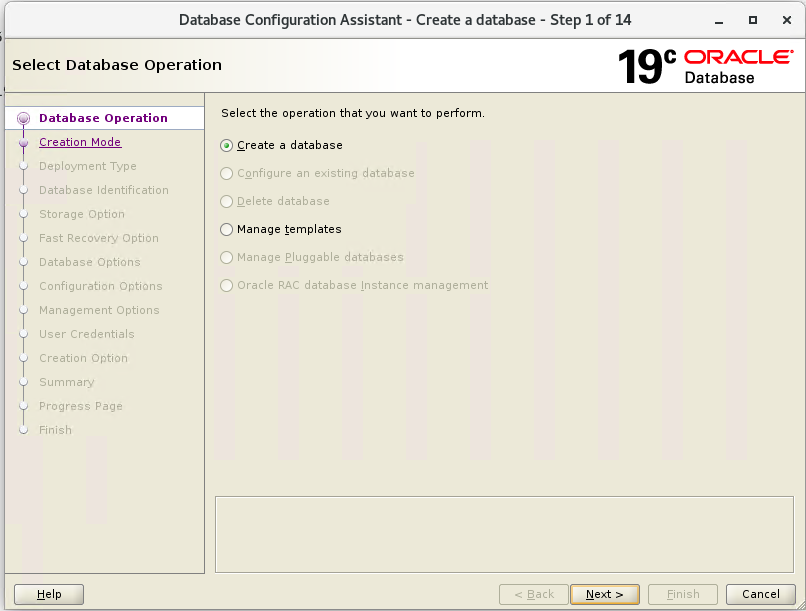

Creation Mode → Advanced configuration

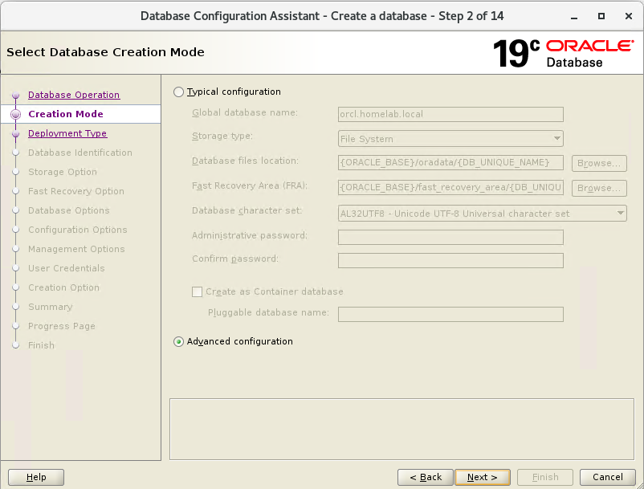

Deployment Type

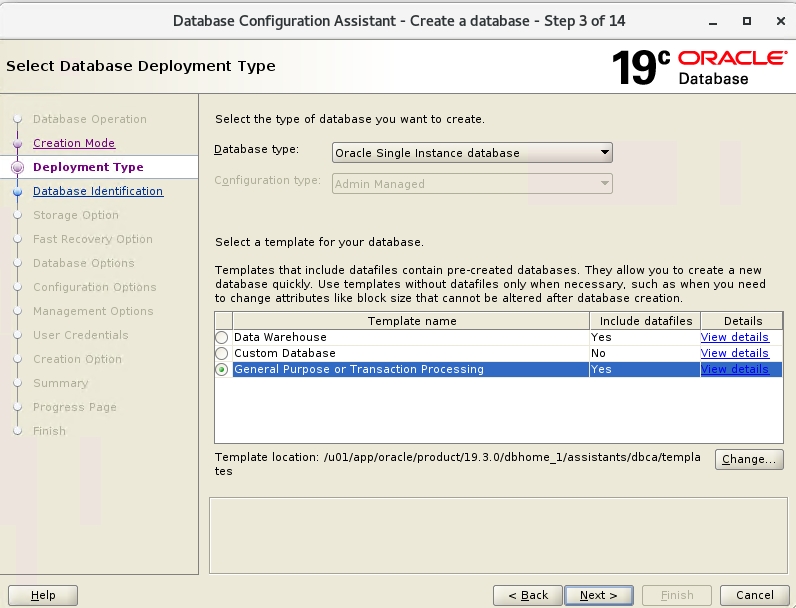

Database Identification

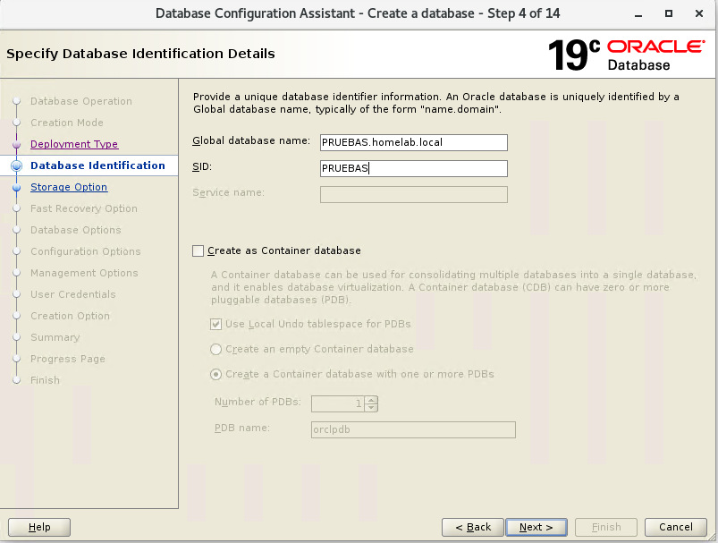

Storage Option

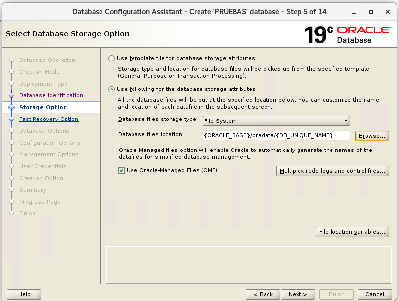

Fast Recovery Option

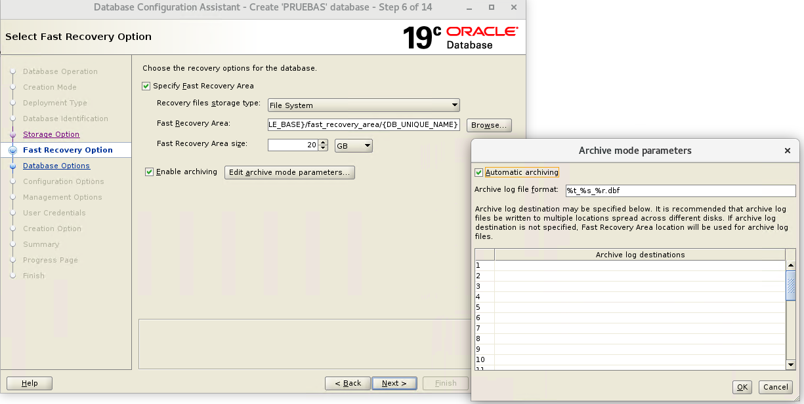

Network Configuration

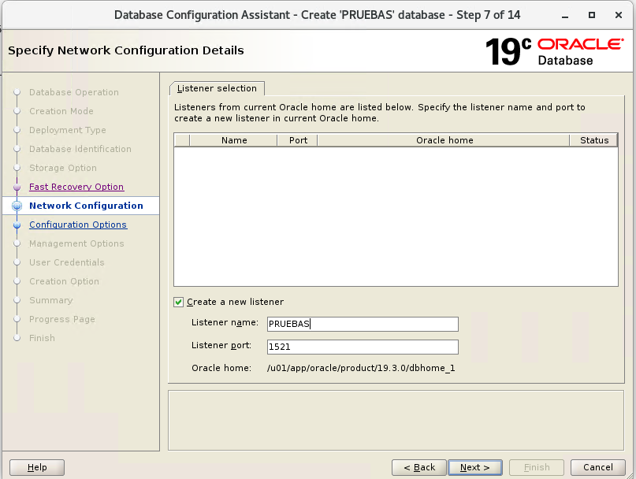

Configuration Options (Memory)

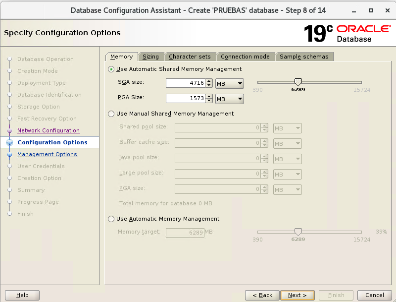

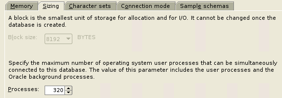

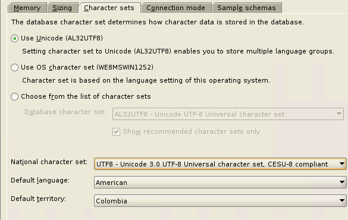

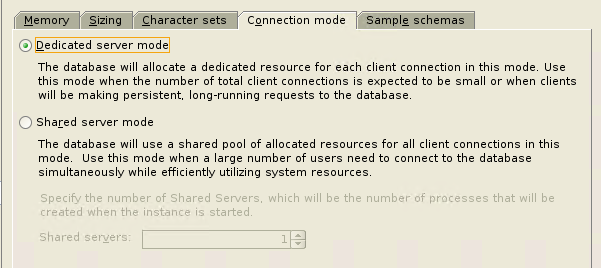

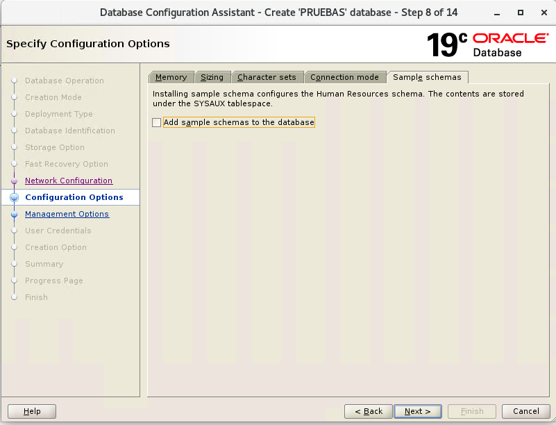

Management Options

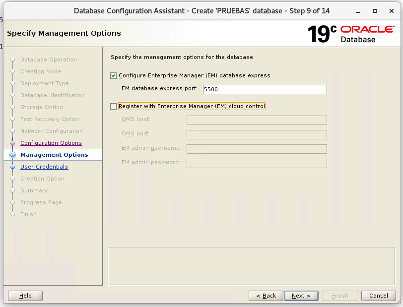

User Credentials — SYS / SYSTEM: `T3CN0L0G14`

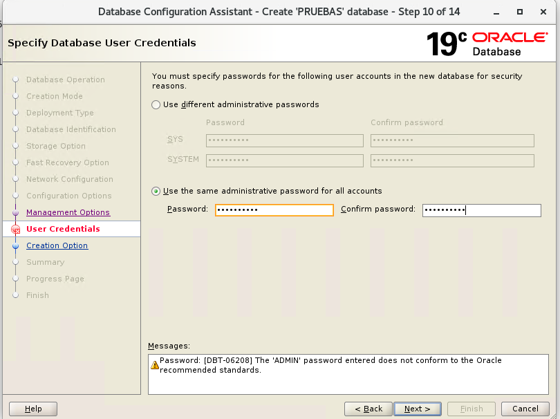

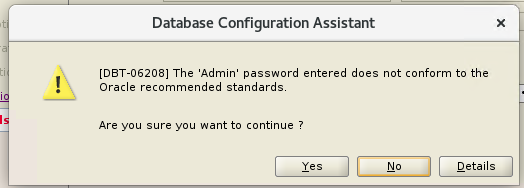

Creation Option

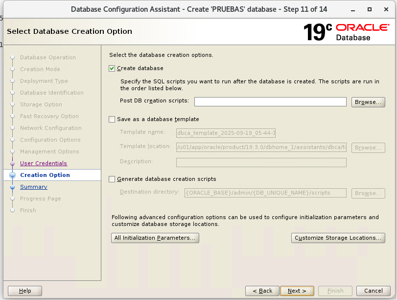

Summary

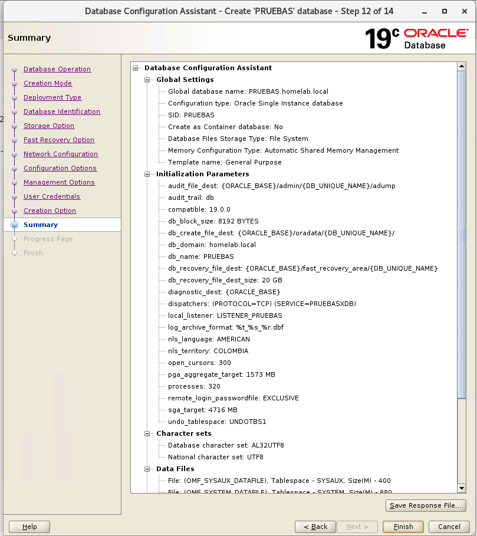

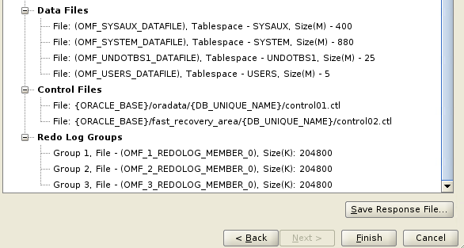

Progress Page

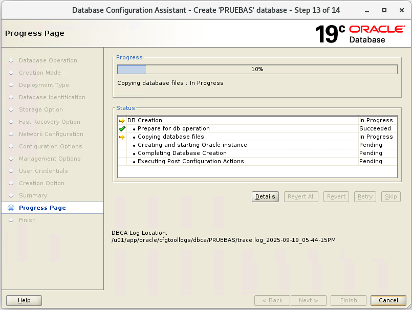

Finish

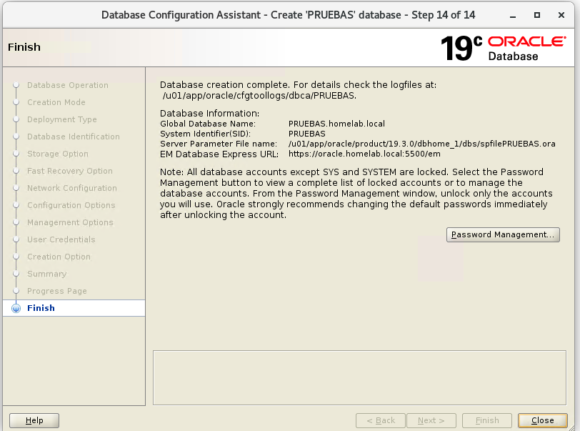

Password Management — Activación usuario para Backup:

| Parámetro | Valor        |
| :-------- | :----------- |
| User      | `SYSBACKUP`  |
| Password  | `T3CN0L0G14` |

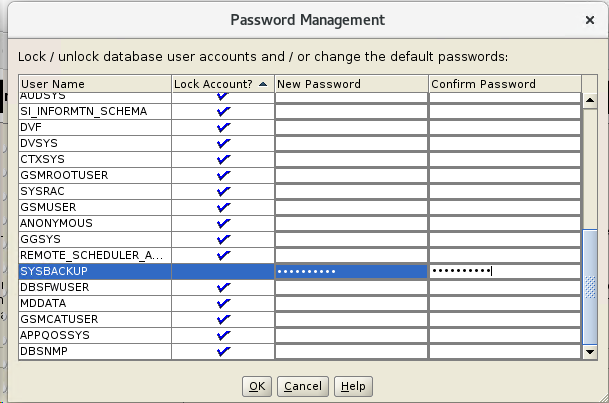

---

## 🔹 Paso 7: Habilitar ARCHIVELOG (opcional)

```sql
sqlplus / as sysdba
SHUTDOWN IMMEDIATE;
STARTUP MOUNT;
ALTER DATABASE ARCHIVELOG;
ALTER DATABASE OPEN;
ARCHIVE LOG LIST;
```

Debe mostrar: `Database log mode: Archive Mode`

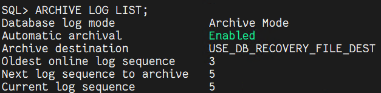

Rutas típicas en disco:

- Con FRA: `/u01/app/oracle/fast_recovery_area/PRUEBAS/archivelog/`
- Sin FRA: `/u01/app/oracle/product/19.3.0/dbhome_1/dbs/arch/`

---

## 🔹 Paso 8: Verificar listener

```bash
lsnrctl status
```

Debe mostrar servicio `PRUEBAS` escuchando en `192.168.1.85:1521`.

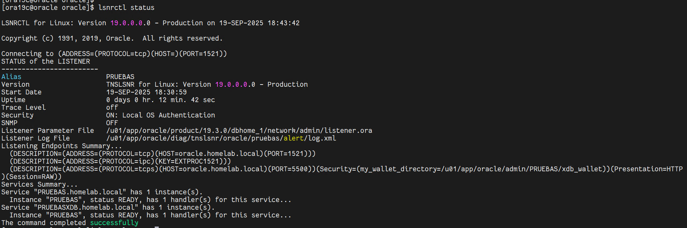

---

## Resultado Final

Consulta de estado de la base de datos:

```sql
SELECT name, open_mode FROM v$database;
```

Resultado:

```
NAME      OPEN_MODE
-------   -----------
PRUEBAS   READ WRITE
```

La base de datos está completamente operativa en modo lectura/escritura.

| Status    | Significado                                  |
| :-------- | :------------------------------------------- |
| `STARTED` | Base iniciada pero no montada ni abierta     |
| `MOUNTED` | Base montada, lista para restaurar datafiles |
| `OPEN`    | Base abierta, lista para uso normal          |

---

## Información del Servidor Oracle

| Parámetro   | Valor                                     |
| :---------- | :---------------------------------------- |
| Host        | `oracle.homelab.local`                    |
| IP          | `192.168.2.10`                            |
| SID         | `PRUEBAS`                                 |
| Usuario SO  | `ora19c` / `ora19c`                       |
| Grupo       | `dba`                                     |
| ORACLE_HOME | `/u01/app/oracle/product/19.3.0/dbhome_1` |

---

## Conexión a la Base de Datos

Usando SQL\*Plus con listener:

```bash
# SYS (SYSDBA)
sqlplus sys/T3CN0L0G14@PRUEBAS as sysdba

# SYSTEM
sqlplus system/T3CN0L0G14@PRUEBAS

# SYSBACKUP
sqlplus SYSBACKUP/T3CN0L0G14@PRUEBAS as sysdba
sqlplus SYSBACKUP/T3CN0L0G14@PRUEBA1 as sysbackup
```

Conexión local sin TNS (directa al servidor):

```bash
sqlplus / as sysdba
```

---

## Verificar el Estado de SYSBACKUP

```sql
SELECT username, account_status, lock_date, expiry_date
FROM dba_users
WHERE username = 'SYSBACKUP';
```

| ACCOUNT_STATUS     | Significado                             |
| :----------------- | :-------------------------------------- |
| `OPEN`             | usuario activo                          |
| `LOCKED`           | usuario bloqueado                       |
| `EXPIRED & LOCKED` | contraseña expirada y usuario bloqueado |
| `EXPIRED`          | contraseña expirada                     |

Habilitar o desbloquear SYSBACKUP (si es necesario):

```sql
ALTER USER SYSBACKUP IDENTIFIED BY TuContraseña VALID UNTIL UNLIMITED ACCOUNT UNLOCK;
```
