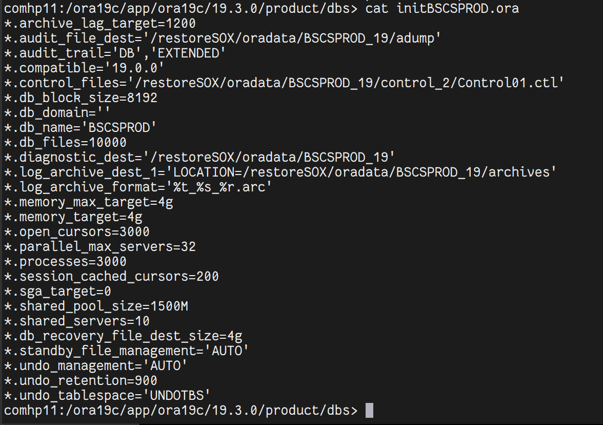

# Restore Oracle 19c en Oracle Linux 7

Restauración completa de Oracle 19c desde Data Protector (RMAN) en Oracle Linux 7.

---

## 🔹 Paso 1: Ajustar permisos del directorio Oracle

Ejecutar como root:

```bash
chown -R ora19c:dba /u01/app/oracle
```

---

## 🔹 Paso 2: Configurar las variables de entorno

Ingresar como usuario `ora19c` y ejecutar:

```bash
export ORACLE_SID=PRUEBAS
export ORACLE_HOME=/u01/app/oracle/product/19.0.0/dbhome_1
export ORACLE_BASE=/u01/app/oracle
export PATH=$ORACLE_HOME/bin:$PATH
```

Verificar:

```bash
echo $ORACLE_SID
echo $ORACLE_HOME
```

---

## 🔹 Paso 3: Crear el PFILE mínimo

Crear el archivo `$ORACLE_HOME/dbs/initPRUEBAS.ora`:

```
db_name=PRUEBAS
memory_target=2G
processes=300
diagnostic_dest='/u01/app/oracle'
control_files='/u01/app/oracle/oradata/PRUEBAS/control01.ctl','/u01/app/oracle/oradata/PRUEBAS/control02.ctl'
```

:::caution
Los controlfiles **NO** deben existir aún; serán restaurados desde Data Protector.
:::



---

## 🔹 Paso 4: Levantar la instancia en NOMOUNT

```sql
sqlplus / as sysdba
STARTUP NOMOUNT PFILE='$ORACLE_HOME/dbs/initPRUEBAS.ora';
```

Salida esperada:

```
ORACLE instance started.

Total System Global Area  2147481656 bytes
Fixed Size                   8898616 bytes
Variable Size             1207959552 bytes
Database Buffers           922746880 bytes
Redo Buffers                 7876608 bytes
```

---

## 🔹 Paso 5: Conexión a RMAN

Desde el usuario `ora19c`:

```bash
rman target /
```

Salida esperada:

```
connected to target database: PRUEBAS (not mounted)
```

---

## 🔹 Paso 6: Restaurar el Control File desde Data Protector

Ejecutar en RMAN:

```sql
run {
  allocate channel 'dev_0' type 'sbt_tape'
  parms 'SBT_LIBRARY=/opt/omni/lib/libob2oracle8_64bit.so,ENV=(OB2BARTYPE=Oracle8,OB2APPNAME=PRUEBAS,OB2BARLIST=ORACLE_PRUEBAS_FULL,OB2BARHOSTNAME=oraclerestore.homelab.local)';
  set until time "to_date('25/10/25 14:18:37','DD/MM/YY HH24:MI:SS')";
  restore controlfile from 'c-3366633431-20251125-00';
  release channel 'dev_0';
}
```

| Instrucción                | Descripción                                                       |
| :------------------------- | :---------------------------------------------------------------- |
| `allocate channel`         | Crea el canal RMAN hacia el agente Oracle de Data Protector (SBT) |
| `SBT_LIBRARY`              | Biblioteca para comunicación RMAN ↔ DP                            |
| `OB2BARTYPE`               | Tipo de integración (Oracle8)                                     |
| `OB2APPNAME`               | Nombre de la BD                                                   |
| `OB2BARLIST`               | Nombre del backup en DP                                           |
| `OB2BARHOSTNAME`           | Servidor donde se ejecuta el restore                              |
| `set until time`           | Define el Point In Time Recovery (PITR)                           |
| `restore controlfile from` | Restaura el controlfile desde el backup especificado              |
| `release channel`          | Libera el canal SBT                                               |

---

## 🔹 Paso 7: Montar la base de datos

En SQL\*Plus (como usuario `ora19c`):

```sql
ALTER DATABASE MOUNT;
```

Salida esperada: `Database altered.`

Verificación:

```sql
SELECT instance_name, status FROM v$instance;
```

```
INSTANCE_NAME    STATUS
----------------  ----------------
PRUEBAS          MOUNTED
```

---

## 🔹 Paso 8: Verificar datafiles y logfiles

Con la base en MOUNTED:

```sql
SELECT file#, name, status FROM v$datafile;
SELECT member FROM v$logfile;
```

Confirmar que las rutas coinciden con `/u01/app/oracle/oradata/PRUEBAS/...`

---

## 🔹 Paso 9: Listar respaldos Full de la BD

En RMAN:

```sql
list backup of database summary;
```

---

## 🔹 Paso 10: Restaurar los DATAFILES usando TAG

Ejecutar en RMAN:

```sql
run {
  allocate channel 'dev_0' type 'sbt_tape'
  parms 'SBT_LIBRARY=/opt/omni/lib/libob2oracle8_64bit.so,ENV=(OB2BARTYPE=Oracle8,OB2APPNAME=PRUEBAS,OB2BARLIST=ORACLE_PRUEBAS_FULL,OB2BARHOSTNAME=oraclerestore.homelab.local)';
  restore database from tag 'TAG20251125T141642';
  switch datafile all;
  release channel 'dev_0';
}
```

---

## 🔹 Paso 11: Consultar los archivelogs catalogados en RMAN

```sql
list archivelog all;
```

---

## 🔹 Paso 12: Restaurar archivelogs por rango de sequence

```sql
run {
  allocate channel dev_0 type 'sbt_tape'
  parms 'SBT_LIBRARY=/opt/omni/lib/libob2oracle8_64bit.so,
  ENV=(OB2BARTYPE=Oracle8,OB2APPNAME=PRUEBAS,
  OB2BARLIST=ORACLE_PRUEBAS_FULL,
  OB2BARHOSTNAME=oraclerestore.homelab.local)';
  restore archivelog
    from sequence 93
    until sequence 106
    thread 1;
  release channel dev_0;
}
```

---

## 🔹 Paso 13: Abrir la base en modo RESETLOGS

En SQL\*Plus:

```sql
ALTER DATABASE OPEN RESETLOGS;
```

- Abre la base incluso si ya no hay más archivelogs disponibles
- Reinicia los redo logs
- Marca la base como consistente hasta el último archivelog aplicado

---

## 🔹 Paso 14: Verificar el estado de la base y datafiles

```sql
SELECT name, status FROM v$datafile;
SELECT sequence#, applied FROM v$archived_log ORDER BY sequence#;
```

---

## 🔹 Paso 15: Confirmar el modo de apertura

```sql
SELECT open_mode FROM v$database;
```

Debe retornar: `READ WRITE`

---

## 🔹 Paso 16: Aplicar CROSSCHECK y RESYNC en RMAN

```bash
rman target /
```

```sql
CROSSCHECK BACKUP;
CROSSCHECK ARCHIVELOG ALL;

DELETE EXPIRED BACKUP;
DELETE EXPIRED ARCHIVELOG ALL;

RESYNC CATALOG;
```

:::note
`RESYNC CATALOG` solo es necesario si usas Recovery Catalog. Si solo manejas control file, omite este paso.
:::
