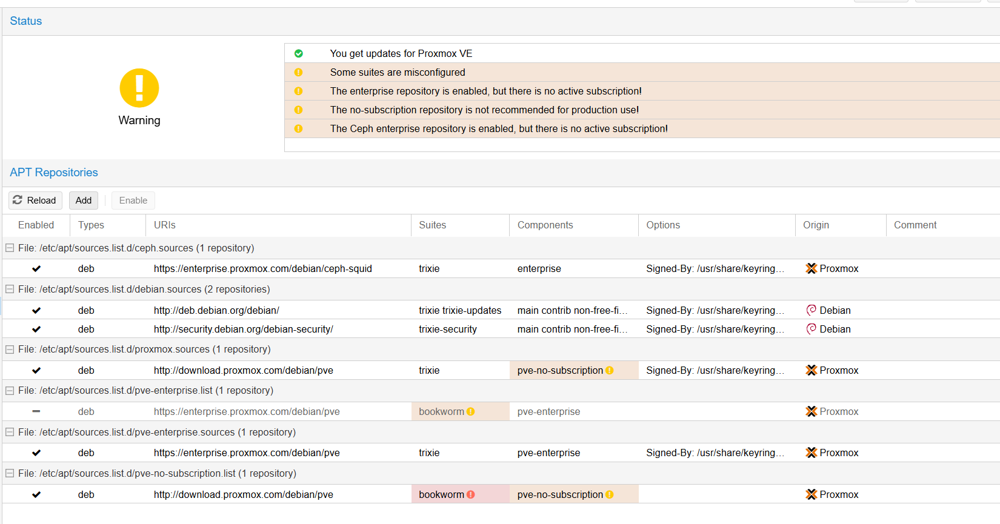
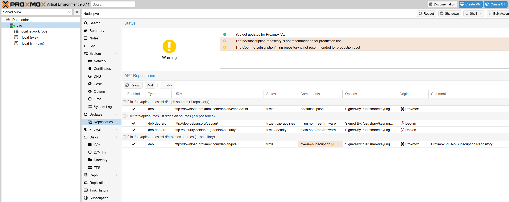

# Post-Install Proxmox 9 – Standalone

Configuración post-instalación de Proxmox VE 9 en modo Standalone (sin suscripción).

---

## 🔹 Paso 1: Eliminar repositorios por defecto



```bash
ls /etc/apt/sources.list.d
```

```
ceph.sources  debian.sources  proxmox.sources  pve-enterprise.list  pve-enterprise.sources  pve-no-subscription.list
```

Eliminar todos los archivos de configuración de repositorios:

```bash
rm /etc/apt/sources.list.d/*
```

---

## 🔹 Paso 2: Validar fuentes

```bash
cat /etc/apt/sources.list
```

El archivo debe estar vacío o sin entradas relevantes.

---

## 🔹 Paso 3: Modernizar fuentes APT

```bash
apt modernize-sources
```

Cuando pregunte, responder `Y` para reescribir las fuentes al nuevo formato `.sources`.

---

## 🔹 Paso 4: Agregar repositorios Debian Base

Editar el archivo:

```bash
nano /etc/apt/sources.list.d/debian.sources
```

Contenido:

```ini
#Debian Base Repositories
Types: deb deb-src
URIs: http://deb.debian.org/debian/
Suites: trixie trixie-updates
Components: main non-free-firmware
Signed-By: /usr/share/keyrings/debian-archive-keyring.gpg

Types: deb deb-src
URIs: http://security.debian.org/debian-security/
Suites: trixie-security
Components: main non-free-firmware
Signed-By: /usr/share/keyrings/debian-archive-keyring.gpg
```

---

## 🔹 Paso 5: Agregar repositorio Proxmox VE 9 (No-Subscription)

```bash
cat > /etc/apt/sources.list.d/proxmox.sources << EOF
Types: deb
URIs: http://download.proxmox.com/debian/pve
Suites: trixie
Components: pve-no-subscription
Signed-By: /usr/share/keyrings/proxmox-archive-keyring.gpg
EOF
```

---

## 🔹 Paso 6: Agregar repositorio Ceph (No-Subscription)

```bash
cat > /etc/apt/sources.list.d/ceph.sources << EOF
Types: deb
URIs: http://download.proxmox.com/debian/ceph-squid
Suites: trixie
Components: no-subscription
Signed-By: /usr/share/keyrings/proxmox-archive-keyring.gpg
EOF
```

---

## 🔹 Paso 7: Actualizar repositorios y sistema

```bash
apt update
apt dist-upgrade
pveversion
```

---

## 🔹 Paso 8: Corregir error de sincronización de tiempo (si aplica)

Si `apt update` falla por problemas de certificados/tiempo:

Editar configuración de Chrony:

```bash
nano /etc/chrony/chrony.conf
```

Agregar estas líneas:

```
server time.google.com iburst
server time.cloudflare.com iburst
server ntp.ubuntu.com iburst
server pool.ntp.org iburst
```

Limpiar fuentes anteriores y reiniciar Chrony:

```bash
rm -f /var/lib/chrony/chrony.drift
systemctl restart chronyd
```

Forzar sincronización y verificar estado:

```bash
chronyc makestep
chronyc tracking
chronyc sources
```

Una vez sincronizado:

```bash
apt clean
rm -rf /var/lib/apt/lists/*
apt update
```



---

## 🔹 Paso 9: Desactivar popup de suscripción

```bash
cp /usr/share/javascript/proxmox-widget-toolkit/proxmoxlib.js{,.bak} && \
sed -i "s/Ext.Msg.show(/void(/" /usr/share/javascript/proxmox-widget-toolkit/proxmoxlib.js && \
systemctl restart pveproxy.service
```

:::note
Esto crea una copia de seguridad del archivo original, desactiva el popup y reinicia el servicio web. Solo quita el aviso visual, no modifica funciones.
:::

---

## 🔹 Paso 10: Configurar hostname, DNS y /etc/hosts

```bash
hostnamectl set-hostname pve.homelab.local
```

Verificar que `/etc/hosts` tenga:

```
127.0.0.1    localhost.localdomain localhost
192.168.2.2  pve.homelab.local pve
```

---

## 🔹 Paso 11: Instalar herramientas útiles (opcional)

```bash
apt install -y sudo vim tmux ncdu zip unzip tree lsof dnsutils traceroute htop iftop iotop net-tools curl wget lsb-release network-manager
```
